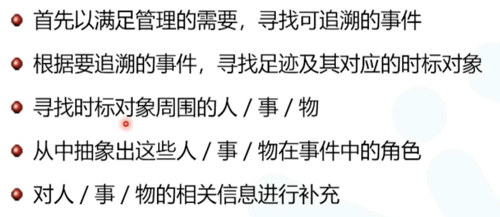

## DDD-奈学课程笔记

>第一节课：https://qcs.h5.xeknow.com/s/1GcBD0
>
>第二节课：https://qcs.h5.xeknow.com/s/2lHKRM
>
> 第三节课:  https://qcs.h5.xeknow.com/s/3gNvXH

#### 第一次课

为什么需要DDD

频繁的变更带来软件的质量下降

需求变更是一种必然-由简单到复杂

小而专的微服务

##### 领域模型及领域建模思想

- 现实世界有什么事物 -> 就有什么对象
- 有什么行为 -> 就有什么方案
- 有什么关系 -> 就有什么关联 

##### 单一职责原则 - SRP

软件系统中的每个元素之完成自己`职责`内的事，将其他的事交给别人去做

代码的维护成本

职责错误理解：一个事情，与该事情相关的事都是它的职责

一个`职责`是一个软件变化的原因

##### 限界上下文

指导微服务的拆分

##### ？领域驱动设计与传统软件开发有什么不同

- 系统越来越复杂、
- 新系统中应用也是为了以后更好维护；
- 先把需求放进领域中 

##### 事件风暴 - Event Storming

是一种基于工作坊的实践方法，它可以快速发现业务领域 中正在发生的事件，指导领域建模及程序开发

被广发应用于业务流程建模和需求工程

基本思想：是将软件开发人员和领域专家聚集在一起，相互学习

为了让学习变得更容易，该方法的工作方式类似于头脑风暴，让事件风暴变得有趣

##### 事件即事实 - Event as Fact

`领域事件`: 即领域中发生的事实 fact  -- 过去式

事实fact ：是指那些已经发生过的事件

鉴于过去已经发生的事实不会发生改变，因此信息系统可以将这些事实以信息的形式储存到数据库中，即信息就是一组事实

##### 事件风暴会议

- 以完成领域模型为目标
- 参与人员：领域专家和软件开发人员
- 会议以探讨领域事件开始，从前往后一次梳理，以确保领域中所有事件都能覆盖
- 成员不断增加各命令与事件，进而思考与之相关的资源、外部系统与时间
- 识别模型中可能的聚合及其聚合根‼️
- 将模型分配到各个限界上下文中，构建上下文地图

#### 第二次课

聚合、聚合根

领域模型 转化成 数据库设计

领域模型 转化成 程序设计

充血模型 失血模型

服务/实体/指对象

- 服务Service
  - 领域建模中标识某些行为或操作
- 实体 Entity
  - 领域建模中由一个标识唯一区分的领域对象
- 值对象 Value Object
  - 领域建模中没有一个标识唯一区分的领域对象

烟囱式微服务设计

小而专的微服务设计

TiDB NewSQL

##### 四色建模法

- 四种原型

  领域对象分成四种原型

  - 时间原型：表示在某个时刻或时间段内发生的某个活动。用粉红色表示 简称MI
  - 角色原型：表示某个人（或事物）以某种角色参与某个事件，用黄色表示，称为 Role
  - 参与者-地点-物品原型：表示事件相关的任务、地点、物品，用绿色表示，简称PPT
  - 描述原型：对PPT原型的描述，用蓝色表示

- 四色建模 过程

  

- 项目应用

#### 第三次课：软件架构如何支持领域驱动

业务领域层 与 各技术框架解耦

整洁结构的设计思想

列式存储

整边架构

六边形架构

防腐层

RIbbon vs. Feign

支持领域的架构：增删改 ，  CQRS

## 美团：领域驱动设计在互联网业务开发中的实践

> @reference https://tech.meituan.com/2017/12/22/ddd-in-practice.html

设计领域模型的一般步骤如下：

1. 根据需求划分出初步的领域和限界上下文，以及上下文之间的关系；
2. 进一步分析每个上下文内部，识别出哪些是实体，哪些是值对象；
3. 对实体、值对象进行关联和聚合，划分出聚合的范畴和聚合根；
4. 为聚合根设计仓储，并思考实体或值对象的创建方式；
5. 在工程中实践领域模型，并在实践中检验模型的合理性，倒推模型中不足的地方并重构。

`战略建模` `战术建模`

战略和战术设计是站在DDD的角度进行划分。战略设计侧重于高层次、宏观上去划分和集成限界上下文，而战术设计则关注更具体使用建模工具来细化上下文。

### 战略建模

#### 领域

现实世界中，领域包含了问题域和解系统。一般认为软件是对现实世界的部分模拟。在DDD中，解系统可以映射为一个个限界上下文，限界上下文就是软件对于问题域的一个特定的、有限的解决方案。

##### 限界上下文

一个由显示边界限定的特定职责。领域模型便存在于这个边界之内。在边界内，每一个模型概念，包括它的属性和操作，都具有特殊的含义。

**我们的实践是，考虑产品所讲的通用语言，从中提取一些术语称之为概念对象，寻找对象之间的联系；或者从需求里提取一些动词，观察动词和对象之间的关系；我们将紧耦合的各自圈在一起，观察他们内在的联系，从而形成对应的界限上下文。形成之后，我们可以尝试用语言来描述下界限上下文的职责，看它是否清晰、准确、简洁和完整。简言之，限界上下文应该从需求出发，按领域划分。**

##### 划分限界上下文

##### 上下文映射图

`康威定律`：任何组织在设计一套系统（广义概念上的系统）时，所交付的设计方案在结构上都与该组织的沟通结构保持一致

限界上下文之间的映射关系

- 合作关系（Partnership）：两个上下文紧密合作的关系，一荣俱荣，一损俱损。
- 共享内核（Shared Kernel）：两个上下文依赖部分共享的模型。
- 客户方-供应方开发（Customer-Supplier Development）：上下文之间有组织的上下游依赖。
- 遵奉者（Conformist）：下游上下文只能盲目依赖上游上下文。
- 防腐层（Anticorruption Layer）：一个上下文通过一些适配和转换与另一个上下文交互。
- 开放主机服务（Open Host Service）：定义一种协议来让其他上下文来对本上下文进行访问。
- 发布语言（Published Language）：通常与OHS一起使用，用于定义开放主机的协议。
- 大泥球（Big Ball of Mud）：混杂在一起的上下文关系，边界不清晰。
- 另谋他路（SeparateWay）：两个完全没有任何联系的上下文

**通过上下文映射关系，我们明确的限制了限界上下文的耦合性，即在抽奖平台中，无论是上下文内部交互（合作关系）还是与外部上下文交互（防腐层），耦合度都限定在数据耦合（Data Coupling）的层级。**

### 战术建模 -- 细化上下文

从战术层面剖析上下文内部的组织关系，DDD中的一些定义：

- `实体`

  当一个对象由其标识（而不是属性）区分时，这种对象称为实体（Entity）

- `值对象`

  当一个对象用于对事务进行描述而没有唯一标识时，它被称作值对象（Value Object）

  具有不变性、相等性、可替换性

- `聚合根`

  Aggregate(聚合）是一组相关对象的集合，作为一个整体被外界访问，聚合根（Aggregate Root）是这个聚合的根节点。

  聚合 由 根实体、值对象、实体组成

  如何创建聚合

  - 边界内的内容具有一致性：在一个事务中只修改一个聚合实例。如果你发现边界内很难接受强一致，不管是出于性能或产品需求的考虑，应该考虑剥离出独立的聚合，采用最终一致的方式。
  - 设计小聚合：大部分的聚合都可以只包含根实体，而无需包含其他实体。即使一定要包含，可以考虑将其创建为值对象。
  - 通过唯一标识来引用其他聚合或实体：当存在对象之间的关联时，建议引用其唯一标识而非引用其整体对象。如果是外部上下文中的实体，引用其唯一标识或将需要的属性构造值对象。 如果聚合创建复杂，推荐使用工厂方法来屏蔽内部复杂的创建逻辑

- `领域服务`

  一些重要的领域行为或操作，可以归类为领域服务。它既不是实体，也不是值对象的范畴。

  当我们采用了微服务架构风格，一切领域逻辑的对外暴露均需要通过领域服务来进行。如原本由聚合根暴露的业务逻辑也需要依托于领域服务。

- `领域事件`

  领域事件是对领域内发生的活动进行的建模。

##### 谨慎使用值对象

虽然一些领域对象符合值对象的概念，但是随着业务的变动，很多原有的定义会发生变更，值对象可能需要在业务意义具有唯一标识，而对这类值对象的重构往往需要较高成本。因此在特定的情况下，我们也要根据实际情况来权衡领域对象的选型

### DDD工程实现

#### 模块

模块（Module）是DDD中明确提到的一种控制限界上下文的手段，工程中，一般尽量用一个模块来表示一个领域的限界上下文。

工程中包的组织方式为{com.公司名.组织架构.业务.上下文.*

模块内的组织结构，一般情况下我们是按照领域对象、领域服务、领域资源库、防腐层等组织方式定义

#### 领域对象

与以往的仅有getter、setter的业务对象不同，领域对象具有了行为，对象更加丰满。同时，比起将这些逻辑写在服务内（例如**Service），领域功能的内聚性更强，职责更加明确

#### 资源库

领域对象需要资源存储，资源库（Repository）的作用，就是对领域的存储和访问进行统一管理的对象

资源库对外的整体访问由Repository提供，它聚合了各个资源库的数据信息，同时也承担了资源存储的逻辑（例如缓存更新机制等）

比起以往将资源管理放在服务中的做法，由资源库对资源进行管理，职责更加明确，代码的可读性和可维护性也更强

#### 防腐层

亦称适配层。在一个上下文中，有时需要对外部上下文进行访问，通常会引入防腐层的概念来对外部上下文的访问进行一次转义

有以下几种情况会考虑引入防腐层：

- 需要将外部上下文中的模型翻译成本上下文理解的模型。
- 不同上下文之间的团队协作关系，如果是供奉者关系，建议引入防腐层，避免外部上下文变化对本上下文的侵蚀。
- 该访问本上下文使用广泛，为了避免改动影响范围过大。

#### 领域服务

领域行为封装到领域对象中，将资源管理行为封装到资源库中，将外部上下文的交互行为封装到防腐层中。此时，我们再回过头来看领域服务时，能够发现领域服务本身所承载的职责也就更加清晰了，即就是通过串联领域对象、资源库和防腐层等一系列`领域内`的对象的行为，对`其他上下文`提供交互的接口

#### 数据流转

首先领域的开放服务通过信息传输对象（DTO）来完成与外界的数据交互；在领域内部，我们通过领域对象（DO）作为领域内部的数据和行为载体；在资源库内部，我们沿袭了原有的数据库持久化对象（PO）进行数据库资源的交互。同时，DTO与DO的转换发生在领域服务内，DO与PO的转换发生在资源库内

与以往的业务服务相比，当前的编码规范可能多造成了一次数据转换，但每种数据对象职责明确，数据流转更加清晰

#### 上下文集成

常见的手段包括开放领域服务接口、开放HTTP服务以及消息发布-订阅机制

#### 分离领域

`应用服务`虽然没有领域逻辑，但涉及到了对多个领域服务的编排。当业务规模庞大到一定程度，编排本身就富含了业务逻辑（除此之外，应用服务在稳定性、性能上所做的措施也希望统一起来，而非散落各处），那么此时应用服务对于外部来说是一个领域服务，整体看起来则是一个独立的限界上下文。

此时应用服务对内还属于应用服务，对外已是领域服务的概念，需要将其暴露为微服务

-- 分层架构  CQRS架构

-- DDD在迭代过程中模型腐化的相关问题

