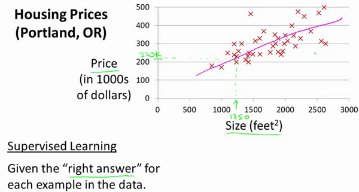
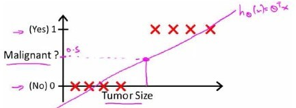
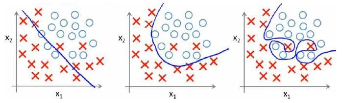
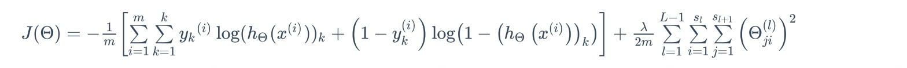

## 两个算法 + 一个网络  🧐

[TOC]

### 0. 几个定义

- **机器学习** -- `Machine Learning`

  - 第一个定义：在进行特定编程的情况下，给予计算机学习能力的领域
  - 年代近一点的定义：一个程序被认为能从经验**E**中学习，解决任务**T**，达到性能度量值**P**，当且仅当，有了经验**E**后，经过**P**评判，程序在处理T时的性能有所提升

- **监督学习 **  -- `Supervised Learning`

  监督学习这个想法是指，我们将**教**计算机如何去完成任务 ( 知道数据集的对应的‘正确答案’，数据的标签、属性

  - 回归问题 - `regression problem`： 一系列离散的值，指试着推出一系列连续值的属性
  - 分类问题 - `classification problem` 推出一组离散的结果

  ex：垃圾邮件问题。如果你有标记好的数据，区别好是垃圾还是非垃圾邮件，我们把这个当作监督学习问题

- **无监督学习** - `Unsupervised Learning`

  无监督学习中，我们打算让它**自己**进行学习  （没有任何的标签或者是有相同的标签或者就是没标签，只有一个数据集，别的什么不知道

  - 聚类算法 - `Clustering Algorithm`: 把数据分成不同的簇

  ex：新闻事件分类的例子：成千上万的新闻被归集成不同类：如 疫情新闻、人声分离

### 1. 线性回归 - Linear Regression

- 单变量线性回归 - Linear Regression with one Variable
- 多变量线性回归 - Linear Regression with multiple Variable

> 一个房价预测例子：

这个例子是预测住房价格的，我们要使用一个数据集，数据集包含波特兰市的住房价格。在这里，我要根据不同房屋尺寸所售出的价格，画出我的数据集。比方说，如果你朋友的房子是1250平方尺大小，你要告诉他们这房子能卖多少钱。那么，你可以做的一件事就是构建一个模型，也许是条直线，从这个数据模型上来看，也许你可以告诉你的朋友，他能以大约220000(美元)左右的价格卖掉这个房子。这就是监督学习算法的一个例子；

#### 模型表示 -  Model Representation

**训练集**`Training Set`:在监督学习中我们有一个数据集，这个数据集被称训练集

**回归问题标记**

$m$ 代表训练集中实例的数量

$x$  代表特征/输入变量

$y$ 代表目标变量/输出变量

$\left( x,y \right)$ 代表训练集中的实例

$({{x}^{(i)}},{{y}^{(i)}})$ 代表第$i$ 个观察实例

$h$  代表学习算法的解决方案或函数也称为假设（**hypothesis**）

这就是一个监督学习算法的工作方式，我们可以看到这里有我们的训练集里房屋价格
我们把它喂给我们的学习算法，学习算法的工作了，然后输出一个函数，通常表示为小写 $h$  表示。$h$  代表**hypothesis**(**假设**)，$h$表示一个函数，输入是房屋尺寸大小， $h$ 根据输入的 $x$值来得出 $y$ 值，$y$ 值对应房子的价格 因此，$h$ 是一个从$x$ 到 $y$ 的函数映射。

一种可能的表达方式为：$h_\theta \left( x \right)=\theta_{0} + \theta_{1}x$，因为只含有一个特征/输入变量，因此这样的问题叫作`单变量线性回归问题`

#### 代价函数 -  Cost Function

- 为模型选择合适的**参数**（**parameters**）$\theta_{0}$ 和 $\theta_{1}$
- 模型所预测的值与训练集中实际值之间的差距，即**建模误差**（**modeling error**）

我们的目标便是选择出可以使得建模误差的平方和能够最小的模型参数。 即使得代价函数 

$$ J \left( \theta_0, \theta_1 \right) = \frac{1}{2m}\sum\limits_{i=1}^m \left( h_{\theta}(x^{(i)})-y^{(i)} \right)^{2}$$

最小

#### 梯度下降 - Gradient Descent

梯度下降是一个用来求函数最小值的算法，我们将使用梯度下降算法来求出代价函数$J(\theta_{0}, \theta_{1})$ 的最小值

梯度下降背后的思想是：开始时我们随机选择一个参数的组合$\left( {\theta_{0}},{\theta_{1}},......,{\theta_{n}} \right)$，计算代价函数，然后我们寻找下一个能让代价函数值**下降最多**的参数组合。我们持续这么做直到找到一个局部最小值（**local minimum**），因为我们并没有尝试完所有的参数组合，所以不能确定我们得到的局部最小值是否便是全局最小值（**global minimum**），选择不同的初始参数组合，可能会找到不同的局部最小值

批量梯度下降（**batch gradient descent**）算法的公式为：

$a$是学习率（**learning rate**），它决定了我们沿着能让代价函数下降程度最大的方向向下迈出的步子有多大，在批量梯度下降中，我们每一次都同时让所有的参数减去学习速率乘以代价函数的导数

#### 梯度下降算法和线性回归算法

如图：

对我们之前的线性回归问题运用梯度下降法，关键在于求出代价函数的导数，即：

$\frac{\partial }{\partial {{\theta }_{j}}}J({{\theta }_{0}},{{\theta }_{1}})=\frac{\partial }{\partial {{\theta }_{j}}}\frac{1}{2m}{{\sum\limits_{i=1}^{m}{\left( {{h}_{\theta }}({{x}^{(i)}})-{{y}^{(i)}} \right)}}^{2}}$

$j=0$  时：$\frac{\partial }{\partial {{\theta }_{0}}}J({{\theta }_{0}},{{\theta }_{1}})=\frac{1}{m}{{\sum\limits_{i=1}^{m}{\left( {{h}_{\theta }}({{x}^{(i)}})-{{y}^{(i)}} \right)}}}$

$j=1$  时：$\frac{\partial }{\partial {{\theta }_{1}}}J({{\theta }_{0}},{{\theta }_{1}})=\frac{1}{m}\sum\limits_{i=1}^{m}{\left( \left( {{h}_{\theta }}({{x}^{(i)}})-{{y}^{(i)}} \right)\cdot {{x}^{(i)}} \right)}$

则算法改写成：

**Repeat {**

​                ${\theta_{0}}:={\theta_{0}}-a\frac{1}{m}\sum\limits_{i=1}^{m}{ \left({{h}_{\theta }}({{x}^{(i)}})-{{y}^{(i)}} \right)}$

​                ${\theta_{1}}:={\theta_{1}}-a\frac{1}{m}\sum\limits_{i=1}^{m}{\left( \left({{h}_{\theta }}({{x}^{(i)}})-{{y}^{(i)}} \right)\cdot {{x}^{(i)}} \right)}$

​               **}**

#### 多变量线性回归

- 多维特征

  $J\left( {\theta_{0}},{\theta_{1}}...{\theta_{n}} \right)=\frac{1}{2m}\sum\limits_{i=1}^{m}{{{\left( h_{\theta} \left({x}^{\left( i \right)} \right)-{y}^{\left( i \right)} \right)}^{2}}}$

   $h_{\theta}\left( x \right)=\theta^{T}X={\theta_{0}}+{\theta_{1}}{x_{1}}+{\theta_{2}}{x_{2}}+...+{\theta_{n}}{x_{n}}$ 

- 特征缩放 

  保证这些特征都具有相近的尺度，这将帮助梯度下降算法更快地收敛，解决的方法是尝试将所有特征的尺度都尽量缩放到-1到1之间，最简单的方法是令：${{x}_{n}}=\frac{{{x}_{n}}-{{\mu}_{n}}}{{{s}_{n}}}$，其中 ${\mu_{n}}$是平均值，${s_{n}}$是标准差

- 多项式回归

  线性回归并不适用于所有数据，有时我们需要曲线来适应我们的数据；比如一个二次方模型：$h_{\theta}\left( x \right)={\theta_{0}}+{\theta_{1}}{x_{1}}+{\theta_{2}}{x_{2}^2}$ 或者三次方模型： $h_{\theta}\left( x \right)={\theta_{0}}+{\theta_{1}}{x_{1}}+{\theta_{2}}{x_{2}^2}+{\theta_{3}}{x_{3}^3}$ 

  

- 正规方程

  某些线性回归问题，正规方程方法是更好的解决方案。如：

  

  正规方程是通过求解下面的方程来找出使得代价函数最小的参数的：$\frac{\partial}{\partial{\theta_{j}}}J\left( {\theta_{j}} \right)=0$ 

### 2. 逻辑回归 - Logistic Regression

在分类问题中，要预测的变量 $y$ 是离散的值， 如一个二元分类问题：我们将因变量(**dependent variable**)可能属于的两个类分别称为负向类（**negative class**）和正向类（**positive class**），则因变量$y\in { 0,1 \\}$ ，其中 0 表示负向类，1表示正向类；

> 预测肿瘤的例子：

根据线性回归模型我们只能预测连续的值，然而对于分类问题，我们需要输出0或1，我们可以预测：

当${h_\theta}\left( x \right)>=0.5$时，预测 $y=1$。

当${h_\theta}\left( x \right)<0.5$时，预测 $y=0$ 。

假使我们又观测到一个非常大尺寸的恶性肿瘤，将其作为实例加入到我们的训练集中来，这将使得我们获得一条新的直线。

这时，再使用0.5作为阀值来预测肿瘤是良性还是恶性便不合适了。可以看出，线性回归模型，因为其预测的值可以超越[0,1]的范围，并不适合解决这样的问题。引入逻辑回归：该模型的输出变量范围始终在0和1之间

#### 模型表示

`逻辑回归模型`的假设是： $h_\theta \left( x \right)=g\left(\theta^{T}X \right)$
其中：
$X$ 代表特征向量
$g$ 代表`逻辑函数（logistic function)`是一个常用的逻辑函数为`S形函数（Sigmoid function）`，公式为： $g\left( z \right)=\frac{1}{1+{{e}^{-z}}}$，图像：

逻辑回归中，我们预测：

当${h_\theta}\left( x \right)>=0.5$时，预测 $y=1$。

当${h_\theta}\left( x \right)<0.5$时，预测 $y=0$ 。

根据上面绘制出的 **S** 形函数图像，我们知道当

$z=0$ 时 $g(z)=0.5$

$z>0$ 时 $g(z)>0.5$

$z<0$ 时 $g(z)<0.5$

又 $z={\theta^{T}}x$ ，即：
${\theta^{T}}x>=0$  时，预测 $y=1$
${\theta^{T}}x<0$  时，预测 $y=0$

#### 判定边界

一个具体的示范模型：

并且参数$\theta$ 是向量[-3 1 1]。 则当$-3+{x_1}+{x_2} \geq 0$，即${x_1}+{x_2} \geq 3$时，模型将预测 $y=1$。
我们可以绘制直线${x_1}+{x_2} = 3$，这条线便是我们模型的`分界线`，将预测为1的区域和预测为 0的区域分隔开

再复杂一些的数据分布：

#### 代价函数

当我们将${h_\theta}\left( x \right)=\frac{1}{1+{e^{-\theta^{T}x}}}$带入到线性回归模型的代价函数中时，我们得到的代价函数将是一个非凸函数（**non-convexfunction**）

这样的代价函数存在很多局部最小值，这将影响梯度下降算法寻找全局最小值

线性回归的代价函数为：$J\left( \theta  \right)=\frac{1}{m}\sum\limits_{i=1}^{m}{\frac{1}{2}{{\left( {h_\theta}\left({x}^{\left( i \right)} \right)-{y}^{\left( i \right)} \right)}^{2}}}$ 。
我们重新定义逻辑回归的代价函数为：$J\left( \theta  \right)=\frac{1}{m}\sum\limits_{i=1}^{m}{{Cost}\left( {h_\theta}\left( {x}^{\left( i \right)} \right),{y}^{\left( i \right)} \right)}$，其中

${h_\theta}\left( x \right)$与 $Cost\left( {h_\theta}\left( x \right),y \right)$之间的关系如下图所示：Amazing‼️‼️⁉️

这样构建的$Cost\left( {h_\theta}\left( x \right),y \right)$函数的特点是：

1. 当实际的  $y=1$ 且${h_\theta}\left( x \right)$也为 1 时误差为 0，
2. 当 $y=1$ 但${h_\theta}\left( x \right)$不为1时误差随着${h_\theta}\left( x \right)$变小而变大；
3. 当实际的 $y=0$ 且${h_\theta}\left( x \right)$也为 0 时代价为 0，
4. 当$y=0$ 但${h_\theta}\left( x \right)$不为 0时误差随着 ${h_\theta}\left( x \right)$的变大而变大

#### 简化的成本函数与梯度下降

将构建的 $Cost\left( {h_\theta}\left( x \right),y \right)$简化如下： 

$Cost\left( {h_\theta}\left( x \right),y \right)=-y\times log\left( {h_\theta}\left( x \right) \right)-(1-y)\times log\left( 1-{h_\theta}\left( x \right) \right)$

带入代价函数得到：

$J\left( \theta  \right)=\frac{1}{m}\sum\limits_{i=1}^{m}{[-{{y}^{(i)}}\log \left( {h_\theta}\left( {{x}^{(i)}} \right) \right)-\left( 1-{{y}^{(i)}} \right)\log \left( 1-{h_\theta}\left( {{x}^{(i)}} \right) \right)]}$

即：$J\left( \theta  \right)=-\frac{1}{m}\sum\limits_{i=1}^{m}{[{{y}^{(i)}}\log \left( {h_\theta}\left( {{x}^{(i)}} \right) \right)+\left( 1-{{y}^{(i)}} \right)\log \left( 1-{h_\theta}\left( {{x}^{(i)}} \right) \right)]}$

拟合训练样本的参数$\theta $，来输出对假设的预测

假设的输出，实际上就是这个概率值：$p(y=1|x;\theta)$，就是关于 $x$以$\theta $为参数，$y=1$ 的概率；

#### 假设函数的区别

对于线性回归假设函数：

${h_\theta}\left( x \right)={\theta^T}X={\theta_{0}}{x_{0}}+{\theta_{1}}{x_{1}}+{\theta_{2}}{x_{2}}+...+{\theta_{n}}{x_{n}}$

而现在逻辑函数假设函数：

${h_\theta}\left( x \right)=\frac{1}{1+{{e}^{-{\theta^T}X}}}$

因此，即使更新参数的规则看起来基本相同，但由于假设的定义发生了变化，所以逻辑函数的梯度下降，跟线性回归的梯度下降实际上是两个完全不同的东西

#### 其他高级算法

梯度下降并不是我们可以使用的唯一算法，还有其他一些算法，更高级、更复杂**共轭梯度法 BFGS** (**变尺度法**) 和**L-BFGS** (**限制变尺度法**) 等

### 3. 过拟合与正则化

- 第一个模型是一个线性模型，欠拟合，不能很好地适应我们的训练集；

- 第三个模型是一个四次方的模型，过于强调拟合原始数据，而丢失了算法的本质：预测新数据。

- 第二个模型是一个二次方模型，较好的拟合了数据，并可以进行新数据预测

以多项式理解，$x$ 的次数越高，拟合的越好，但相应的预测的能力就可能变差；

分类问题中也存在这样的问题：

过拟合的处理：

1. 丢弃一些不能帮助我们正确预测的特征。手工选择/模型选择的算法

2. 正则化。 保留所有的特征，但是减少参数的大小（**magnitude**）

### 4. 神经网络 - Neural Networks

无论是线性回归还是逻辑回归都有这样一个缺点，即：当特征太多时，计算的负荷会非常大

假设我们希望训练一个模型来识别视觉对象（例如识别一张图片上是否是一辆汽车），我们怎样才能这么做呢？一种方法是我们利用很多汽车的图片和很多非汽车的图片，然后利用这些图片上一个个像素的值来作为特征

#### 模型表示

为了构建神经网络模型，我们需要首先思考大脑中的神经网络是怎样的？每一个神经元都可以被认为是一个处理单元/神经核（**processing unit**/**Nucleus**），它含有许多输入/树突（**input**/**Dendrite**），并且有一个输出/轴突（**output**/**Axon**）。神经网络是大量神经元相互链接并通过电脉冲来交流的一个网络

类似于神经元的神经网络，效果如下：

其中$x_1$, $x_2$, $x_3$是输入单元（**input units**），我们将原始数据输入给它们。
$a_1$, $a_2$, $a_3$是中间单元，它们负责将数据进行处理，然后呈递到下一层。
最后是输出单元，它负责计算${h_\theta}\left( x \right)$

神经网络模型是许多逻辑单元按照不同层级组织起来的网络，每一层的输出变量都是下一层的输入变量。下图为一个3层的神经网络，第一层成为`输入层（Input Layer）`，最后一层称为`输出层（Output Layer）`，中间一层成为`隐藏层（Hidden Layers）`

为了更好了了解**Neuron Networks**的工作原理，我们先把左半部分遮住：

右半部分其实就是以$a_0, a_1, a_2, a_3$, 按照**Logistic Regression**的方式输出$h_\theta(x)$：

其实神经网络就像是**logistic regression**，只不过我们把**logistic regression**中的输入向量$\left[ x_1\sim {x_3} \right]$ 变成了中间层的$\left[ a_1^{(2)}\sim a_3^{(2)} \right]$, 即:  $h_\theta(x)=g\left( \Theta_0^{\left( 2 \right)}a_0^{\left( 2 \right)}+\Theta_1^{\left( 2 \right)}a_1^{\left( 2 \right)}+\Theta_{2}^{\left( 2 \right)}a_{2}^{\left( 2 \right)}+\Theta_{3}^{\left( 2 \right)}a_{3}^{\left( 2 \right)} \right)$ 
我们可以把$a_0, a_1, a_2, a_3$看成更为高级的特征值，也就是$x_0, x_1, x_2, x_3$的进化体，并且它们是由 $x$与$\theta$决定的，因为是梯度下降的，所以$a$是变化的，并且变得越来越厉害，所以这些更高级的特征值远比仅仅将 $x$次方厉害，也能更好的预测新数据。
这就是神经网络相比于逻辑回归和线性回归的优势

#### 简单的AND函数

我们可以用这样的一个神经网络表示**AND** 函数：

其中$\theta_0 = -30, \theta_1 = 20, \theta_2 = 20$
我们的输出函数$h_\theta(x)$即为：$h_\Theta(x)=g\left( -30+20x_1+20x_2 \right)$

我们知道$g(x)$的图像是：

所以我们有：$h_\Theta(x) \approx \text{x}_1 \text{AND} \, \text{x}_2$

#### 多类分类

当我们不止两种分类的时呢？

输入向量$x$有三个维度，两个中间层，输出层4个神经元分别用来表示4类，也就是每一个数据在输出层都会出现${{\left[ a\text{ }b\text{ }c\text{ }d \right]}^{T}}$，且$a,b,c,d$中仅有一个为1，表示当前类。下面是该神经网络的可能结构示例：

#### 代价函数

在逻辑回归中，我们只有一个输出变量，又称标量（**scalar**），也只有一个因变量$y$，但是在神经网络中，我们可以有很多输出变量，我们的$h_\theta(x)$是一个维度为$K$的向量，并且我们训练集中的因变量也是同样维度的一个向量；

代价函数为：

$$h_\theta\left(x\right)\in \mathbb{R}^{K}$$ $${\left({h_\theta}\left(x\right)\right)}_{i}={i}^{th} \text{output}$$

#### 反向传播算法

我们在计算神经网络预测结果的时候我们采用了一种正向传播方法，我们从第一层开始正向一层一层进行计算，直到最后一层的$h_{\theta}\left(x\right)$。

现在，为了计算代价函数的偏导数$\frac{\partial}{\partial\Theta^{(l)}_{ij}}J\left(\Theta\right)$，我们需要采用一种反向传播算法，也就是首先计算最后一层的误差，误差是激活单元的预测（${a^{(4)}}$）与实际值（$y^k$）之间的误差；利用这个误差值来计算前一层的误差，然后再一层一层反向求出各层的误差，直到倒数第二层。

#### 梯度检验

当我们对一个较为复杂的模型（例如神经网络）使用梯度下降算法时，可能会存在一些不容易察觉的错误，意味着，虽然代价看上去在不断减小，但最终的结果可能并不是最优解。

为了避免这样的问题，我们采取一种叫做梯度的数值检验（**Numerical Gradient Checking**）方法。这种方法的思想是通过估计梯度值来检验我们计算的导数值是否真的是我们要求的。

对梯度的估计采用的方法是在代价函数上沿着切线的方向选择离两个非常近的点然后计算两个点的平均值用以估计梯度。即对于某个特定的 $\theta$，我们计算出在 $\theta$-$\varepsilon $ 处和 $\theta$+$\varepsilon $ 的代价值（$\varepsilon $是一个非常小的值，通常选取 0.001），然后求两个代价的平均，用以估计在 $\theta$ 处的代价值

#### 参数初始化

任何优化算法都需要一些初始的参数。到目前为止我们都是初始所有参数为0，这样的初始方法对于逻辑回归来说是可行的，但是对于神经网络来说是不可行的。如果我们令所有的初始参数都为0，这将意味着我们第二层的所有激活单元都会有相同的值。同理，如果我们初始所有的参数都为一个非0的数，结果也是一样的。

我们通常初始参数为正负ε之间的随机值

#### 综合起来

网络结构：第一件要做的事是选择网络结构，即决定选择多少层以及决定每层分别有多少个单元。

第一层的单元数即我们训练集的特征数量。

最后一层的单元数是我们训练集的结果的类的数量。

如果隐藏层数大于1，确保每个隐藏层的单元个数相同，通常情况下隐藏层单元的个数越多越好。

训练神经网络：

1. 参数的随机初始化
2. 利用正向传播方法计算所有的$h_{\theta}(x)$
3. 编写计算代价函数 $J$ 的代码
4. 利用反向传播方法计算所有偏导数
5. 利用数值检验方法检验这些偏导数
6. 使用优化算法来最小化代价函数

------

以上，感谢🙏

> @Reference: ML - AndrewNg 

