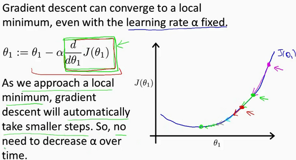

## chapter_1-单变量线性回归（Linear Regression with One Variable）

>  房价预测的例子：

这个例子是预测住房价格的，我们要使用一个数据集，数据集包含俄勒冈州波特兰市的住房价格。在这里，我要根据不同房屋尺寸所售出的价格，画出我的数据集。比方说，如果你朋友的房子是1250平方尺大小，你要告诉他们这房子能卖多少钱。那么，你可以做的一件事就是构建一个模型，也许是条直线，从这个数据模型上来看，也许你可以告诉你的朋友，他能以大约220000(美元)左右的价格卖掉这个房子。这就是监督学习算法的一个例子

### 模型表示

**训练集**`Training Set`:在监督学习中我们有一个数据集，这个数据集被称训练集

**回归问题标记**

$m$ 代表训练集中实例的数量

$x$  代表特征/输入变量

$y$ 代表目标变量/输出变量

$\left( x,y \right)$ 代表训练集中的实例

$({{x}^{(i)}},{{y}^{(i)}})$ 代表第$i$ 个观察实例

$h$  代表学习算法的解决方案或函数也称为假设（**hypothesis**）

这就是一个监督学习算法的工作方式，我们可以看到这里有我们的训练集里房屋价格
我们把它喂给我们的学习算法，学习算法的工作了，然后输出一个函数，通常表示为小写 $h$  表示。$h$  代表**hypothesis**(**假设**)，$h$表示一个函数，输入是房屋尺寸大小，就像你朋友想出售的房屋，因此 $h$ 根据输入的 $x$值来得出 $y$ 值，$y$ 值对应房子的价格 因此，$h$ 是一个从$x$ 到 $y$ 的函数映射。

我将选择最初的使用规则$h$代表**hypothesis**，因而，要解决房价预测问题，我们实际上是要将训练集“喂”给我们的学习算法，进而学习得到一个假设$h$，然后将我们要预测的房屋的尺寸作为输入变量输入给$h$，预测出该房屋的交易价格作为输出变量输出为结果。那么，对于我们的房价预测问题，我们该如何表达 $h$？

一种可能的表达方式为：$h_\theta \left( x \right)=\theta_{0} + \theta_{1}x$，因为只含有一个特征/输入变量，因此这样的问题叫作`单变量线性回归问题`。

### 代价函数 - Cost Function

现在要做的便是为我们的模型选择合适的**参数**`parameters`$\theta_{0}$ 和 $\theta_{1}$，在房价问题这个例子中便是直线的斜率和在$y$ 轴上的截距。

我们选择的参数决定了我们得到的直线相对于我们的训练集的准确程度，模型所预测的值与训练集中实际值之间的差距（下图中蓝线所指）就是**建模误差**`modeling error`

我们的目标便是选择出可以使得建模误差的平方和能够最小的模型参数。 即使得`代价函数 `$J \left( \theta_0, \theta_1 \right) = \frac{1}{2m}\sum\limits_{i=1}^m \left( h_{\theta}(x^{(i)})-y^{(i)} \right)^{2}$最小。  

> Tip: 除以2m是为了后面求导时，可以和指数2消去

我们绘制一个`等高线图`，三个坐标分别为$\theta_{0}$和$\theta_{1}$ 和$J(\theta_{0}, \theta_{1})$：

则可以看出在三维空间中存在一个使得$J(\theta_{0}, \theta_{1})$最小的点。

`代价函数`也被称作**平方误差函数**，有时也被称为**平方误差代价函数**。我们之所以要求出误差的平方和，是因为误差平方代价函数，对于大多数问题，特别是回归问题，都是一个合理的选择。还有其他的代价函数也能很好地发挥作用，但是**平方误差代价函数可能是解决回归问题最常用的手段**了。

#### 代价函数的作用

简化问题假设$\theta_{0}$取0不断改变参数$\theta_{1} $，寻找 minimize

$\theta_{0}\theta_{1}$同时改变通过代价函数的样子，等高线图，则可以看出在三维空间中存在一个使得$J(\theta_{0}, \theta_{1})$最小的点

我们真正需要的是一种有效的算法，能够自动地找出这些使代价函数$J$取最小值的参数$\theta_{0}$和$\theta_{1}$来

### 梯度下降 - Gradient Descent

`梯度下降`是一个用来求函数最小值的算法，我们将使用梯度下降算法来求出代价函数$J(\theta_{0}, \theta_{1})$ 的最小值

`梯度下降思想`是：开始时我们随机选择一个参数的组合$\left( {\theta_{0}},{\theta_{1}},......,{\theta_{n}} \right)$，计算代价函数，然后我们寻找下一个能让代价函数值下降最多的参数组合。我们持续这么做直到找到一个局部最小值（**local minimum**），因为我们并没有尝试完所有的参数组合，所以不能确定我们得到的局部最小值是否便是全局最小值（**global minimum**），选择不同的初始参数组合，可能会找到不同的局部最小值。

> 想象一下你正站立在山的这一点上，站立在你想象的公园这座红色山上，在梯度下降算法中，我们要做的就是旋转360度，看看我们的周围，并问自己要在某个方向上，用小碎步尽快下山。这些小碎步需要朝什么方向？如果我们站在山坡上的这一点，你看一下周围，你会发现最佳的下山方向，你再看看周围，然后再一次想想，我应该从什么方向迈着小碎步下山？然后你按照自己的判断又迈出一步，重复上面的步骤，从这个新的点，你环顾四周，并决定从什么方向将会最快下山，然后又迈进了一小步，并依此类推，直到你接近局部最低点的位置

**批量梯度下降** `batch gradient descent`算法的公式为：

其中$a$是**学习率**`learning rate`，它决定了我们沿着能让代价函数下降程度最大的方向向下迈出的**步子有多大**，在批量梯度下降中，我们每一次都**同时**让所有的参数减去学习速率乘以代价函数的导数

在梯度下降算法中，还有一个更微妙的问题，梯度下降中，我们要更新${\theta_{0}}$和${\theta_{1}}$ ，当 $j=0$ 和$j=1$时，会产生更新，所以你将更新$J\left( {\theta_{0}} \right)$和$J\left( {\theta_{1}} \right)$。实现梯度下降算法的微妙之处是，在这个表达式中，如果你要更新这个等式，你需要**同时更新**${\theta_{0}}$和${\theta_{1}}$，我的意思是在这个等式中，我们要这样更新：

${\theta_{0}}$:= ${\theta_{0}}$ ，并更新${\theta_{1}}$:= ${\theta_{1}}$。

实现方法是：你应该计算公式右边的部分，通过那一部分计算出${\theta_{0}}$和${\theta_{1}}$的值，然后同时更新${\theta_{0}}$和${\theta_{1}}$

同时更新是梯度下降中的一种常用方法。

- 如果$a$太小了，即我的学习速率太小，可能会很慢，因为它会一点点挪动，它会需要很多步才能到达全局最低点。
- 如果$a$太大，那么梯度下降法可能会越过最低点，甚至可能无法收敛，下一次迭代又移动了一大步，越过一次，又越过一次，一次次越过最低点
- 如果你的参数已经处于局部最低点，那么梯度下降法更新其实什么都没做，它不会改变参数的值。这也解释了为什么即使学习速率$a$保持不变时，梯度下降也可以收敛到局部最低点

#### 梯度下降的线形回归 - GradientDescentForLinearRegression

梯度下降是很常用的算法，它不仅被用在线性回归上和线性回归模型、平方误差代价函数。在这段视频中，我们要将梯度下降和代价函数结合。我们将用到此算法，并将其应用于具体的拟合直线的线性回归算法里。

梯度下降算法和线性回归算法比较如图：

对我们之前的线性回归问题运用梯度下降法，关键在于求出代价函数的导数，即：

$\frac{\partial }{\partial {{\theta }_{j}}}J({{\theta }_{0}},{{\theta }_{1}})=\frac{\partial }{\partial {{\theta }_{j}}}\frac{1}{2m}{{\sum\limits_{i=1}^{m}{\left( {{h}_{\theta }}({{x}^{(i)}})-{{y}^{(i)}} \right)}}^{2}}$

$j=0$  时：$\frac{\partial }{\partial {{\theta }_{0}}}J({{\theta }_{0}},{{\theta }_{1}})=\frac{1}{m}{{\sum\limits_{i=1}^{m}{\left( {{h}_{\theta }}({{x}^{(i)}})-{{y}^{(i)}} \right)}}}$

$j=1$  时：$\frac{\partial }{\partial {{\theta }_{1}}}J({{\theta }_{0}},{{\theta }_{1}})=\frac{1}{m}\sum\limits_{i=1}^{m}{\left( \left( {{h}_{\theta }}({{x}^{(i)}})-{{y}^{(i)}} \right)\cdot {{x}^{(i)}} \right)}$

则算法改写成：

**Repeat {**

​                ${\theta_{0}}:={\theta_{0}}-a\frac{1}{m}\sum\limits_{i=1}^{m}{ \left({{h}_{\theta }}({{x}^{(i)}})-{{y}^{(i)}} \right)}$

​                ${\theta_{1}}:={\theta_{1}}-a\frac{1}{m}\sum\limits_{i=1}^{m}{\left( \left({{h}_{\theta }}({{x}^{(i)}})-{{y}^{(i)}} \right)\cdot {{x}^{(i)}} \right)}$

​               **}**

