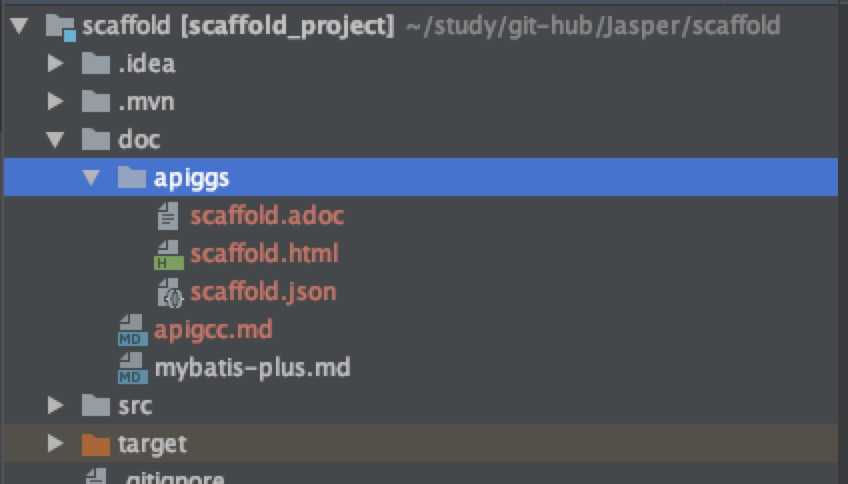
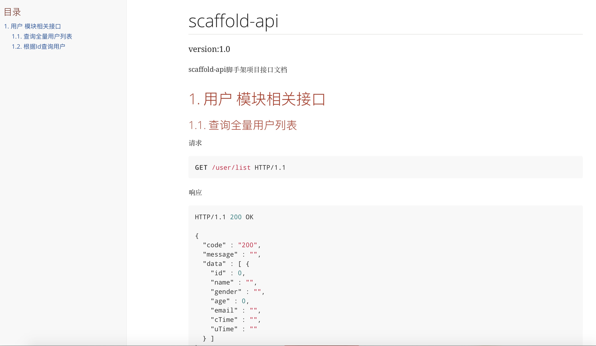
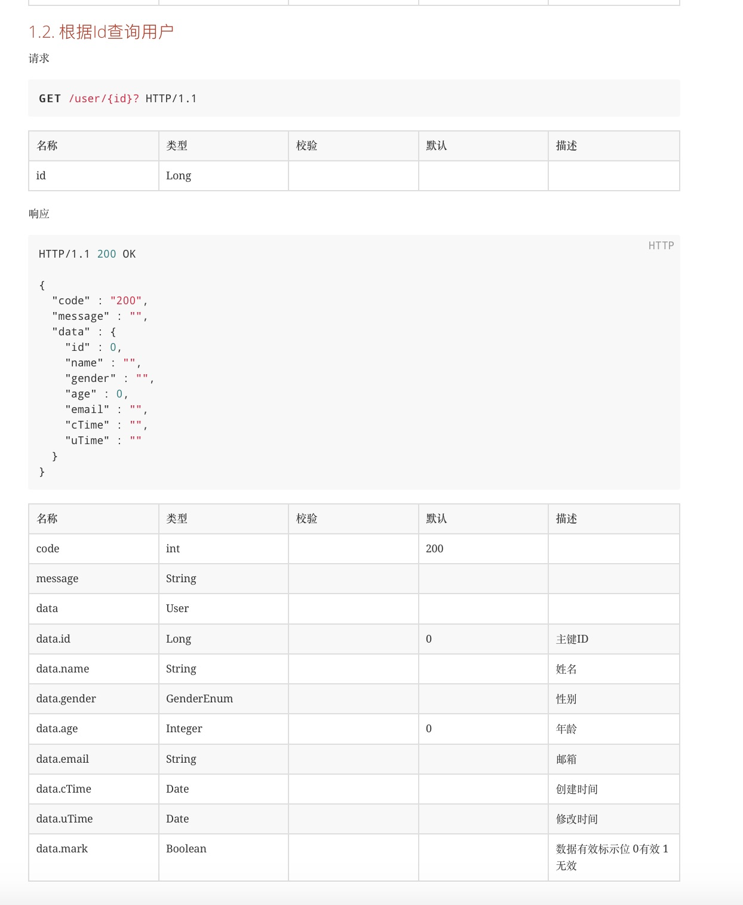

## Apigcc - 非侵入的RestDoc文档生成工具

> [Apigcc](https://github.com/apigcc/apigcc)是一个**非侵入**的RestDoc文档生成工具。工具通过分析代码和注释，获取文档信息，生成RestDoc文档

### Springboot 通过maven集成

- `pom`引入拓展插件

  ```xml
  <plugin>
      <groupId>com.github.apiggs</groupId>
      <artifactId>apiggs-maven-plugin</artifactId>
      <version>1.6</version>
      <executions>
          <execution>
              <phase>compile</phase>
              <goals>
                  <goal>apiggs</goal>
              </goals>
          </execution>
      </executions>
      <configuration>
          <!--生成文件名称 xxx.html-->
          <id>scaffold</id>
          <title>scaffold-api</title>
          <description>scaffold-api脚手架项目接口文档</description>
          <!-- 生成文件 输出目录 -->
          <out>doc</out>
          <version>1.0</version>
          <!--production 输出文件夹，默认为 apiggs-->
          <!--out 输出目录，默认为 target-->
          <!--source 源码目录-->
          <!--dependency 源码依赖的代码目录，以逗号隔开-->
          <!--jar 源码依赖的jar包目录，以逗号隔开-->
          <!--ignore 忽略某些类型-->
      </configuration>
  </plugin>
  ```

- ` <configuration>`更多选项配置

  - `id` 项目id，生成id.html文件
  - `title` 文档标题
  - `description` 文档描述
  - `production` 输出文件夹，默认为 apiggs
  - `out` 输出目录，默认为 target
  - `source` 源码目录
  - `dependency` 源码依赖的代码目录，以逗号隔开
  - `jar` 源码依赖的jar包目录，以逗号隔开
  - `ignore` 忽略某些类型
  - `version` 文档版本号

- 示例接口

  ```java
      /**
       * 查询全量用户列表
       * @return
       */
      @GetMapping("list")
      public Result<List<User>> getUserList() {
          return ResultGenerator.genSuccessResult(userService.list());
      }
  
      /**
       * 根据Id查询用户
       * @param id
       * @return
       */
      @GetMapping("/{id}")
      public Result<User> getUserById(@PathVariable Long id) {
          return ResultGenerator.genSuccessResult(userService.getById(id));
      }
  ```

- `compile`后则在配置的输出目录自动生成接口文档，包含

  - `xxx.adoc`、`xxx.html`、`xxx.json`

    

- 生成文档整体效果

  

- 具体接口示例

  

  > Tip: 
  >
  > - Controller接口层只需正常写注释即可，无需其他操作
  > - 接口返回结果VO实体，字段注释写的完整，也会直接在接口文档中体现
  > - 如果接口层封装了统一的返回结果Result层，需要使用泛型声明，否则Apigcc识别不了，不能准确返回具体VO类型