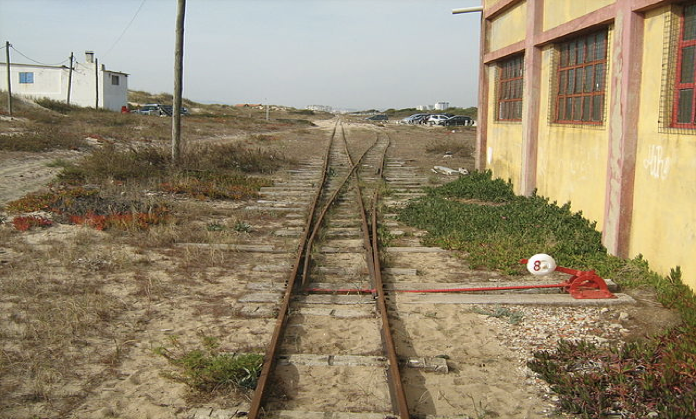
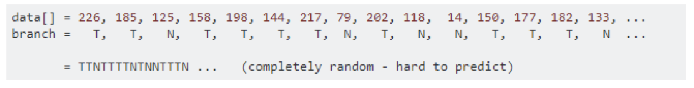
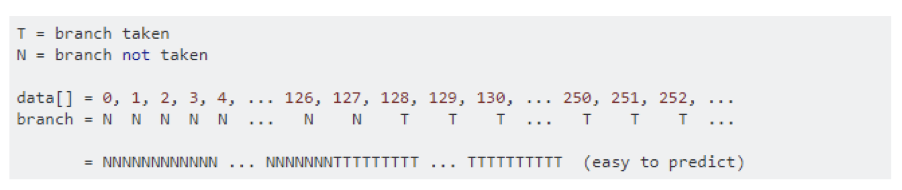
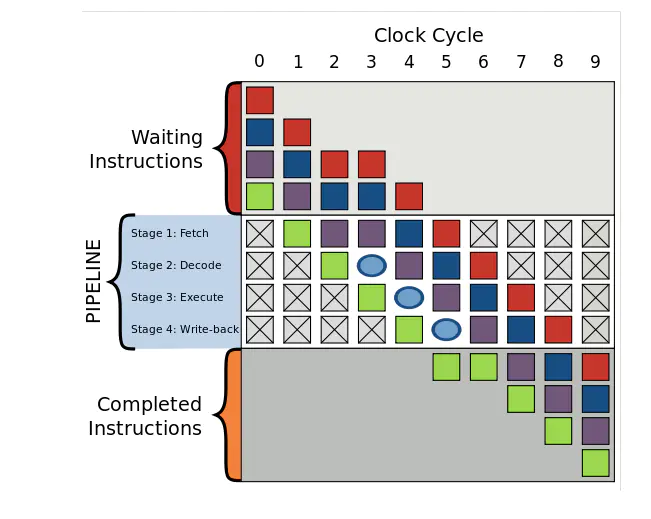
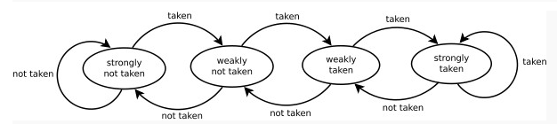
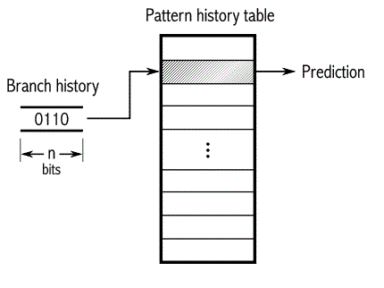

## 分支预测(Branch Prediction)

#### 问题：一个排序带来的差异

```java
public static void main(String[] args) {
    int size = 32768;
    int data[] = new int[size];

    Random random = new Random(0);
    for (int i = 0; i < size; i++) {
        data[i] = random.nextInt() % 256;
    }
	
    // 是否排序
    Arrays.sort(data);

    long start = System.nanoTime();
    long sum = 0;

    for (int i = 0; i < 100000; i++) {
        for (int j = 0; j < size; j++) {
            if (data[j] >= 128) {
                sum += data[j];
            }
        }
    }
    System.out.println((System.nanoTime() - start) / 1000000000.0);
    System.out.println("sum = " + sum);
}
```

- 未排序耗时：` 11.333646239`
- 排序后耗时： `3.729554356`

- why ？

### Branch Predictor



> #### Ask or Guess direction ？ 

- 如果猜对了 - 继续行驶

- 如果猜错了 - 停车、倒回去、调整轨道，重新启动、继续行驶

- **如果每次都猜对** - 永远不用停车、一直向前
- **如果每次都猜错** -  反复停车、倒车、重启

`分支预测（Branch Prediction）`是现代处理器用来提高CPU执行速度的一种手段, 其对程序的分支流程进行预测, 然后预先读取其中一个分支的指令并解码来减少等待译码器的时间.

维基百科 	`a strategy in computer architecture design for mitigating the costs usually associated with conditional branches, particularly branches to short sections of code."`


> #### How to predict it ?

导致非排序数组耗时显著增加的 `if-statement`

```java
if (data[j] >= 128) {
    sum += data[j];
}
```

- T = 分支命中
- N = 分支没有命中

#### unsorted  data



#### sorted data



> #### Why need ?

- ##### CPU Instruction Pipeline

  Pipieline假设程序运行时有一连串指令要被运行，将程序运行划分成几个阶段，按照一定的顺序处理

  `四个执行阶段(execuate stage)`:

  - 读取指令(`Fetch`)  
  - 指令解码(`Decode`)  
  - 运行指令(`Execute`) 
  - 写回运行结果(`Write-back`)

- ##### 分支预测器

  分支预测器是一种数字电路，在分支指令执行前，猜测哪一个分支会被执行，条件分支通常有两路后续执行分支，not token时,跳过接下来的JMP指令，继续执行， token时，执行JMP指令，跳转到另一块程序内存去执行

- ##### 假设没有分支预测

  如果**没有分支预测器**，处理器会等待分支指令通过了pipeline的执行阶段(execuate stage)才能把下一条指令送入pipeline的fetch stage，这会造成`流水线停顿/冒泡`

  

  **加入分支预测器**后，为避免流水线停顿，其会猜测两路分支哪一路最有可能执行，然后投机执行，如果猜错，则流水线中投机执行中间结果全部抛弃，重新获取正确分支路线上的指令执行。所以，错误的预测也会导致程序执行的延迟。

  **复杂的流水线，好的分支预测器非常重要**

> #### Two Strategy

- ##### 静态预测

  - 编译时进行

  - 任选一条分支： 

    1. 认为Branch一定会 token

    2.  认为Branch一定不会token

  - 平均命中率： 50%

- ##### 动态预测

  - 运行时进行
  - 根据同一条转移指令过去的转移情况来预测未来的转移情况
    - 分支预测缓冲区 - `Branch Prediction Buff`
    - 分支历史表 - `Branch history table`

> #### Some predict model

- ##### 饱和计数

  

  - 强不选择 - Strongly not taken
  - 弱不选择 - Weakly not taken
  - 弱选择 - Weakly taken
  - 强选择 - Strongly taken

  当一个分支命令被求值，对应的状态机被修改。分支不采纳，则向*“*强不选择*”*方向降低状态值；如果分支被采纳，则向*“*强选择*”*方向提高状态值。这种方法的优点是，该条件分支指令必须连续选择某条分支两次，才能从强状态翻转，从而改变了预测的分支

- ##### 两级自适应预测器



​			对于一条分支指令，如果每2次执行发生一次条件跳转，或者其它的规则发生模式，那么用上文提到的饱和计			数器就很难预测了。如图所示，一种二级自适应预测器可以记住过去n次执行该指令时的分支情况的历史，可			能的2^n种历史模式的每一种都有1个专用的饱和计数器，用来表示如果刚刚过去的n次执行历史是此种情况			那么根据这个饱和计数器应该预测为跳转还是不跳转

- ##### 其他分支预测器

  - 局部分支预测
  - 全局分支预测
  - 融合分支预测
  - 神经分支预测器……

> #### How to optimize ？

1. ##### 避免在循环中嵌套条件分支. 如果可能,将分支移到外部, 使用多个子循环

   ```java
   do {
       if (condition_1){
           //branch_1
       } else if (condition_2){
           //branch_2
       } else {
           //branch_3
       } //if
   } while (true);
   ```

   ```java
   //改进版本
   if (condition_1) {
       do {
           //branch_1
       } while (true);
   } else if (condition_2) {
       do {
           //branch_2
       } while (true);
   } else {
       do {
           //branch_3
       } while (true);
   } //if
   ```

   

2. ##### 合并分支条件. 此举在某种情况下可以大大降低产生错误分支预测的概率

   ```java
   if (condition_1 == 0 || condition_2 == 0 || condition_3 == 0) {
   		//branch
   } //if
    
   //改进版本:
   if ((condition_1 | condition_2 | condition_3) == 0) {
       //branch
   } //if
   ```

   ⁉️合并分支条件. 是否真的有必要呢？因为不优化的时候实际上是有条件短路的可能，避免不必要的计算；而优 化后可能还涉及到cache miss和冗余计算

3. ##### 移除明显的条件分支, 将执行概率大的条件分支移前

   这一条不仅仅有助于规避错误分支带来的性能惩罚, 还减少了不必要的检测分支条件消耗的CPU时钟周期.

4. ##### for( ; ; )  and while(true)

   ```c
   // 编译前
   while(true);
   
   // 编译后
   mov eax,1  
   test eax,eax   // branch
   je foo+23h
   jmp foo+18h
   ```

   ```c
   // 编译前
   for(;;);
   
   // 编译后
   jmp foo+23h
   ```

   

以上- 

谢谢